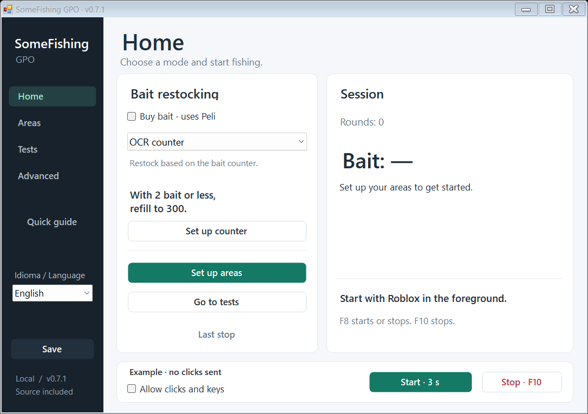

# SomeFishing GPO

Visual fishing macro for GPO on Windows. Source code is included for inspection and local compilation. Version **0.7.1**.

Choose **English** from **Idioma / Language** in the left sidebar. Switching is immediate and your choice is saved. This setting is separate from the counter's Windows OCR language.

## Get started

1. Extract the entire ZIP and open `SomeFishingGPO.exe`. Requires 64-bit Windows 10/11 and .NET Framework 4.8. No administrator permission is required.
2. Equip your rod and cast once manually. Use **F6** to select the full blue bar with room for its sideways movement. Enter or F6 confirms; Esc cancels.
3. In **Areas**, choose a casting point on the water. Check the detector in **Tests → Readings**.
4. Check **Allow clicks and keys**, return to Roblox and press **F8**. **F10** stops. Switching windows or moving the mouse to the top-left corner also stops the macro.

The macro follows the fish's white marker by raising or lowering the gray gap. The green progress bar is ignored. Before casting, including after a purchase, the pointer moves gradually to the water point and waits until it is stable.

## Restock bait

Stand within reach of the bait barrel while facing somewhere you can fish. In **Areas**, mark the centers of all three purchase buttons: left **Yes/Buy**, middle **quantity/…**, right **No/Cancel**. Close the dialogs before starting.

- **OCR counter:** select only the equipped bait's `x` and quantity. At 2 bait or less, request enough to reach a capacity of 300 (298 when 2 remain). Threshold and capacity are adjustable in **Advanced**. This does not read the dialog's MAX or your Peli balance.
- **Timer:** request 50 bait every 40 minutes, with both values adjustable. No counter OCR is needed.

Enable **Buy bait** in **Home** to use automatic restocking. Purchases spend in-game Peli. Fishing pauses for the purchase sequence and resumes afterwards. **Tests → Purchase** performs one purchase of your chosen quantity without waiting for the counter or timer and stops without casting.

## Settings and language

**Home** contains the basic mode settings; **Areas** contains selections; **Tests** contains purchase and reading checks. **Advanced** contains timings, colors, thresholds and the counter OCR language. Leave these values unchanged if you are unsure about them.

Your interface language is saved in `ajustes.xml` alongside the existing settings. Updating preserves saved values and points. Windows system dialogs and system error messages may follow Windows' own language. Previously saved logs remain in the language in which they were written.

## Transparency and limitations

The app captures selected screen areas and sends standard Windows input. It does not use network connections, download updates, inject code or read game memory. F8/F10 and focus checks stay the same in both languages. All translations are embedded locally in the executable.

The app checks the colors of the quantity-menu buttons before critical purchase steps. It does not verify the entered quantity, payment or final closing inside the game. OCR depends on scale, font and background; check it under **Tests → Readings**. Re-select points if the game window or layout changes.

Run `compilar.cmd` to compile using the local .NET Framework compiler and Windows SDK. `SomeFishingGPO.exe --self-test output-folder` runs simulated checks without game input. Source and validation details are included in `src` and `docs`.

Source code is provided **without granting a license at this time**. See [NOTICE.md](NOTICE.md). See [SECURITY.md](SECURITY.md) and [CHANGELOG.md](CHANGELOG.md) for the full Spanish documentation.
