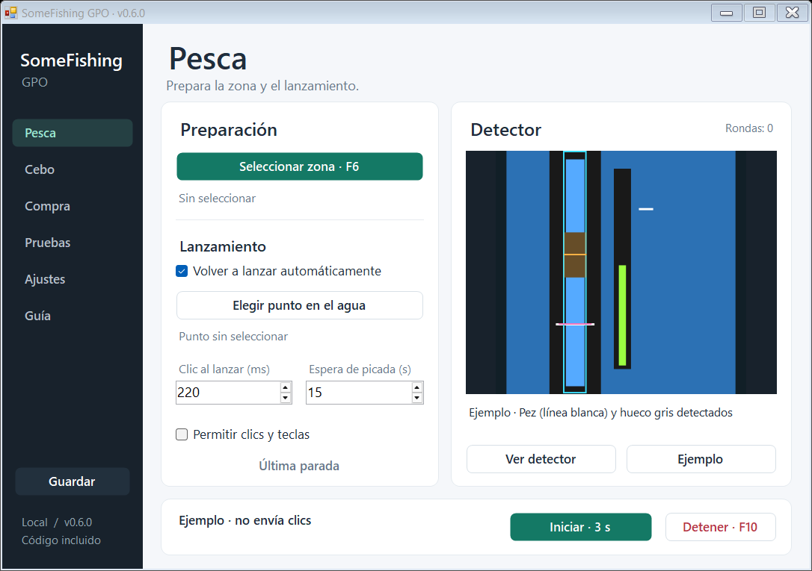
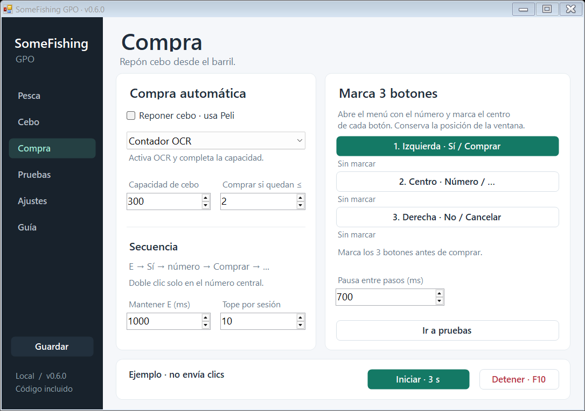
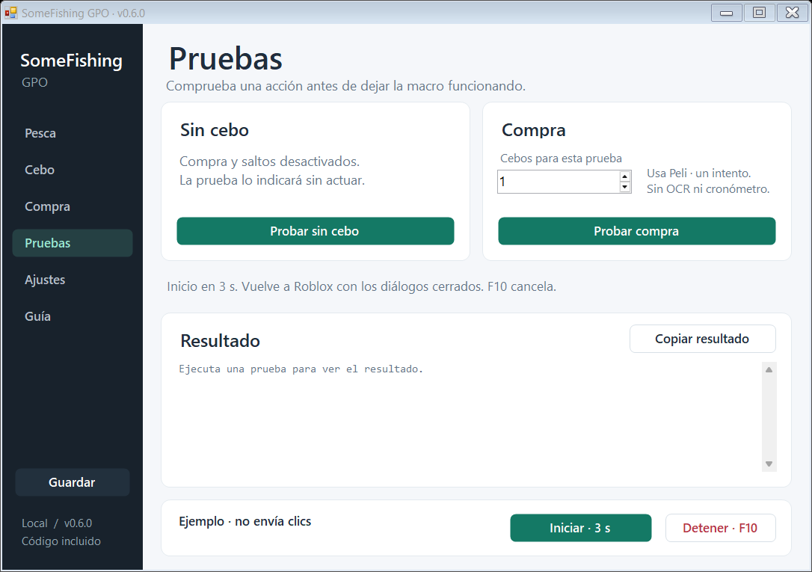

# SomeFishing GPO

Macro visual de pesca para GPO en Windows, con código disponible para revisar y compilar. **Versión local 0.6.0.**

## Empezar

Extrae el ZIP completo y abre `SomeFishingGPO.exe`. Requiere Windows 10 u 11 de 64 bits y .NET Framework 4.8. No necesita permisos de administrador. Conserva `ajustes.xml` al actualizar.

1. Equipa la caña y lanza manualmente una vez.
2. Pulsa **F6** y rodea toda la barra azul, con margen para su movimiento lateral. Enter o F6 confirma; Esc cancela.
3. Usa **Ver detector** y **Elegir punto en el agua**. La barra verde se ignora.
4. Activa **Permitir clics y teclas**, vuelve a Roblox y pulsa **F8**.

**F10 detiene**. Cambiar de ventana o llevar el ratón a la esquina superior izquierda también detiene la macro y libera las entradas. Iniciar desde la aplicación deja tres segundos para volver al juego.

Mantener clic sube el hueco gris; soltarlo lo baja. La macro sigue la línea blanca, comprueba el cierre de cada ronda y vuelve a lanzar. Las rondas cuentan tanto capturas como escapes.

## Compra: tres botones y dos modos

Coloca al personaje junto al barril, al alcance de **E**, desde un lugar donde pueda pescar. En **Compra**, marca el centro de estos botones:

| Punto | Función |
|---|---|
| Izquierdo | **Sí** en la pregunta inicial y **Comprar** en el menú de cantidad |
| Central | El **número** editable y el botón final **…** |
| Derecho | **No / Cancelar**; se guarda para comprobar el orden, sin pulsarlo en la compra |

Abre manualmente el menú correspondiente antes de marcar cada punto. La selección se hace sobre una captura: ese clic no se envía al juego. Los tres deben estar en la misma fila y mantener sus posiciones entre diálogos. Si cambias la ventana, resolución o posición del menú, vuelve a marcarlos. Cierra los diálogos antes de iniciar una sesión o prueba.

Activa **Reponer cebo** y elige un modo:

- **Contador OCR:** al confirmar **2 cebos o menos**, repone hasta **300**. Por ejemplo, con 2 solicita **298**; con 1 solicita **299**. Umbral y capacidad son ajustables. Aquí «máximo» significa completar la capacidad configurada: no lee el MAX del diálogo ni calcula cuánto permite comprar tu saldo.
- **Cronómetro:** solicita **50 cebos cada 40 minutos**, ambos ajustables. No necesita OCR ni seleccionar el contador.

Cuando toca comprar, suelta el clic de pesca y espera que cierre el minijuego. Si había un lanzamiento pendiente, conserva su ventana de picada. Después ejecuta **E → Sí → doble clic en el número → escribir cantidad → Comprar → …** con pausas. Al terminar la secuencia reanuda la pesca y comienza un intervalo nuevo. Al soltar el clic durante una ronda, el pez puede escaparse.

La secuencia usa los puntos guardados, **sin OCR de los menús**. No verifica que el juego haya aceptado el número, el pago o el cierre; muestra que la secuencia se envió. No hay reintentos dentro de una compra. El tope de intentos por sesión es ajustable (10 inicialmente). En modo contador, el disparador solo se rearma tras confirmar una cantidad superior al umbral; un número bajo persistente no encadena compras.

## Contador y aviso previo

En **Cebo**, selecciona solo el contador del cebo equipado, por ejemplo `x300`, dejando margen para tres dígitos. Evita el borde del botón y otros números. **Probar lectura** solo observa.

Puedes elegir entre **Automático (Windows)** y los idiomas OCR instalados. El procesamiento es local. Las lecturas positivas requieren dos capturas coincidentes y el cero requiere tres. Una lectura desconocida o un contador desaparecido nunca se convierten en cero para calcular una compra.

Los recortes pequeños de **x2, x3 y x4** tienen apoyo de reconocimiento visual. Con 3 o 4 confirmados aparece un aviso de compra próxima al usar el umbral inicial de 2. El aviso no compra antes del umbral. Esto mejora las muestras probadas, pero no garantiza reconocer cualquier fuente, escala o fondo.

Los saltos de espera son opcionales. Tras falta de cebo o tres intentos sin minijuego puede enviar Espacio a intervalos, sin direcciones. No garantiza evitar desconexiones ni conservar objetos.

## Pruebas

**Probar compra** ejecuta una sola compra de la cantidad indicada (1 inicialmente), aunque el OCR no lea, queden más de 2 cebos, no haya vencido el cronómetro o esté apagada la reposición automática. **Usa Peli real del juego.** Necesita los tres puntos marcados, permiso de entradas y Roblox en primer plano. No inicia pesca al terminar.

**Probar sin cebo** simula cero: compra una unidad si habilitaste reposición, prueba un salto si solo habilitaste saltos, o informa de que ambas opciones están apagadas. No prueba la exactitud del OCR real.

En ambas pruebas, termina el minijuego y cierra los diálogos antes de empezar. F10 cancela. El registro queda en `ultima-prueba.txt`; **Copiar resultado** solo lo copia cuando pulsas el botón.

Si E no abre el diálogo, comprueba que estás al alcance del barril y aumenta **Mantener E**. Si la secuencia avanza demasiado pronto, aumenta **Pausa entre pasos**. Prueba con una unidad y comprueba visualmente los cinco clics antes de activar compras repetidas.

## Compilar y revisar

Ejecuta `compilar.cmd` con .NET Framework 4.8 y Windows 10/11 SDK instalados. Usa el compilador local; no descarga paquetes. El SDK no hace falta para ejecutar el binario distribuido.

`SomeFishingGPO.exe --self-test carpeta-de-resultados` ejecuta comprobaciones con entradas simuladas y genera imágenes sintéticas de la interfaz. No envía teclas ni clics al juego. La suite conserva regresiones del lector de menús anterior; la interfaz actual usa la compra por puntos.

- `src/Core.cs`: ajustes, seguimiento de pesca, contador y cronómetro.
- `src/DirectPurchase.cs`: secuencia de compra por puntos.
- `src/Native.cs`: captura e inputs de Windows, comprobaciones de foco y liberación.
- `src/WindowsBaitReader.cs`, `src/CounterGlyphs.cs`: lectura local de cebo.
- `src/App.cs`, `src/Interface.cs`: interfaz y selección.
- `docs/VERIFICACION.txt`, `docs/SHA256.txt`: resultados de la versión y huella del ejecutable.

El programa no usa red, descarga actualizaciones ni lee la memoria del juego. Un antivirus sin detecciones no constituye una garantía absoluta. Consulta [SECURITY.md](SECURITY.md). Se publica el código **sin conceder una licencia por ahora**; consulta [NOTICE.md](NOTICE.md).