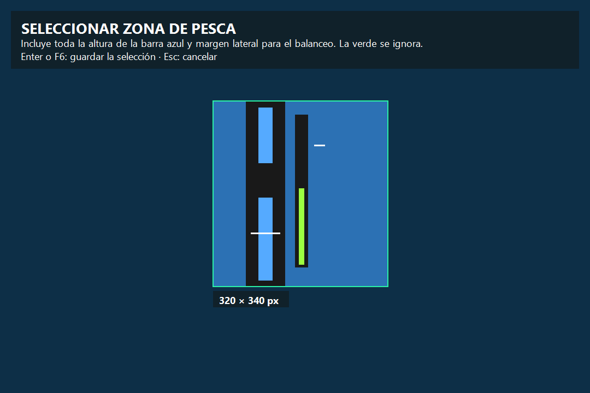
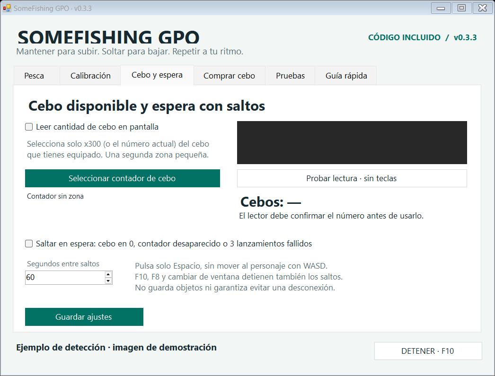

# SomeFishing GPO

Macro visual para el minijuego de pesca de GPO en Windows. Su objetivo es ofrecer un programa sencillo, transparente y revisable, con el código completo y una forma de compilarlo localmente.

**Compilación local 0.3.3: reconocimiento visual de x2 y tiempo ajustable al mantener E.** Incluye reposición de cebo y detección de su desaparición. Todavía necesita validación en partidas reales. No promete una tasa de capturas, evitar todas las desconexiones ni una garantía absoluta de ausencia de virus.


## Cómo funciona

El programa localiza la barra azul dentro de una zona seleccionada y mantiene la línea blanca del pez dentro del hueco gris: mantener el clic sube el hueco; soltarlo lo baja. La barra verde indica el progreso del juego y se excluye del seguimiento.

El ciclo es **lanzar → esperar → seguir al pez → comprobar el cierre del menú → volver a lanzar**. El contador registra rondas terminadas, tanto si hubo captura como si escapó el pez.

## Descargar y empezar

Esta compilación se entrega como `SomeFishing-GPO-v0.3.3-win-x64.zip`: extrae toda la carpeta y abre `SomeFishingGPO.exe`. La 0.3.3 todavía no se ha publicado en GitHub; la última publicación es la [versión preliminar 0.3.1](https://github.com/Someflo/SomeFishing-GPO/releases/tag/v0.3.1). Para conservar las zonas y opciones de una versión anterior, cierra la macro y copia su `ajustes.xml` a la nueva carpeta. Requiere Windows 10 u 11 de 64 bits, .NET Framework 4.8 y el cliente de escritorio de Roblox. La lectura de cebo y de los menús utiliza el reconocimiento de texto de Windows y necesita al menos un idioma OCR disponible para tu perfil. La aplicación no descarga ni instala idiomas. El SDK solo es necesario para recompilar, no para ejecutar el binario entregado.

1. Abre Roblox en ventana o sin bordes, equipa la caña y lanza una vez manualmente.
2. Con el minijuego visible, pulsa **F6**. Dibuja **una sola zona** con toda la altura de la barra azul y sus dos bordes oscuros. Deja margen lateral para su pequeño balanceo. La barra verde puede quedar dentro.
3. Confirma con **Enter o F6**. **Esc** cancela sin perder la selección anterior.
4. Pulsa **Ver detector**: el contorno celeste debe seguir la barra azul, naranja marca el hueco y rosa marca el pez. Esta vista no envía clics. Mantén la ventana de la macro fuera de la zona del juego que captura.
5. Selecciona **Elegir punto sobre el agua**. Marca **Permitir clics y teclas al iniciar**.
6. Vuelve a Roblox y pulsa **F8**. **F10** detiene la macro; F8 también alterna inicio y parada.

La selección debe cubrir el recorrido de la barra. Incluye algo de margen vertical, pero procura que la barra ocupe la mayor parte de la altura. Se admiten hasta 1200 px de ancho, 1400 px de alto y 600 000 píxeles en total.



## Leer el cebo y saltar durante la espera

Estas funciones empiezan desactivadas y se configuran en la pestaña **Cebo y espera**.

1. Pulsa **Seleccionar contador de cebo** y dibuja una **segunda zona pequeña**, únicamente alrededor del número del cebo equipado, por ejemplo `x300`. Incluye un poco de margen para que quepan más dígitos, pero excluye el borde amarillo del botón, que puede impedir la lectura. Confirma con Enter o F6. No selecciones el nombre, los dos tipos de cebo ni la barra verde. La zona del minijuego se conserva.
2. Activa **Probar lectura · sin teclas**. Comprueba que el número mostrado coincide con el juego antes de iniciar la macro. La vista de prueba no envía clics ni saltos. El contador debe permanecer visible en esa posición.
3. Marca **Saltar en espera: cebo en 0, contador desaparecido o 3 lanzamientos fallidos**. El intervalo inicial es **60 segundos**; puedes ajustarlo entre 15 y 300 segundos.
4. Pulsa **Guardar ajustes**, termina la prueba de lectura, vuelve a Roblox y usa F8 para iniciar con el permiso de clics y saltos marcado.



El lector procesa únicamente la zona del contador con OCR local de Windows, en un segundo plano. Exige que dos tamaños de la imagen produzcan el mismo número. Además, confirma los números positivos en dos capturas diferentes y el cero en tres. Una imagen ausente, ilegible o ambigua se muestra como **desconocida**, nunca se convierte automáticamente en cero. No suma los dos tipos de cebo ni cambia entre ellos.

Desde la 0.3.1, si la lectura original falla, el lector aísla las letras amarillas o anaranjadas, elimina franjas blancas y normaliza su tamaño antes de volver a leerlas. También exige coincidencia entre dos escalas y rechaza números contradictorios con la lectura original. En la captura de la vista previa con `x300` y una franja blanca reconoce **300**; también lo hace al reconstruir esa vista al tamaño de selección de **44 × 25 px**. Esa reconstrucción no sustituye la comprobación de la selección real: usa **Probar lectura** y espera a ver **Cebos: 300** confirmado antes de iniciar.

**Límite observado:** en las capturas de desarrollo reconoce los **300 y 295 cebos comunes** al excluir el borde del botón, pero no reconoce con fiabilidad los **42 raros**. Otros tamaños, fondos y dígitos también requieren comprobar la lectura. Si no reconoce tu contador, puedes usar los saltos tras tres lanzamientos sin minijuego con la lectura de cebo desactivada; la compra automática necesita la lectura activada.

Como el contador normalmente permanece visible, la versión 0.3.0 también comprueba su desaparición: primero debe haber confirmado una cantidad en la sesión y después recibir al menos cuatro capturas nuevas sin texto amarillo durante **8 segundos o más**. Un fallo del OCR con texto aún visible, una lectura antigua o un contador que nunca llegó a reconocerse no basta. El estado se informa como **contador desaparecido**, sin inventar un cero. Tapar el contador durante suficiente tiempo puede parecer una desaparición; mantén su zona despejada.

| Situación | Comportamiento |
|---|---|
| El minijuego se cierra después de una ronda | Espera la pausa habitual y vuelve a lanzar; ese cierre por sí solo no activa saltos |
| Se confirma que quedan 0 cebos | Termina el minijuego activo; si ya lanzó, conserva la espera de la última picada. Después entra en espera |
| Desaparece durante al menos 8 segundos un contador que antes se leía bien | Termina la pesca activa y trata la desaparición como posible falta de cebo |
| Fallan tres lanzamientos sin aparecer el minijuego | Entra en espera aunque el contador sea desconocido |
| Entra en espera con saltos habilitados | Suelta el clic y solicita un salto tras unos 2 segundos sin menú; después repite al intervalo configurado |
| Reaparece el minijuego durante la espera | Suspende los saltos y reanuda el seguimiento cuando confirma la detección |
| Se repone cebo tras una espera causada por cero confirmado | Reanuda los lanzamientos cuando confirma una cantidad positiva |
| La espera comenzó por tres lanzamientos fallidos | Permanece en espera hasta que reaparezca el minijuego o reinicies con F8; no reintenta indefinidamente |
| Los saltos están desactivados | Se detiene cuando se confirma la falta de cebo o fallan los tres intentos |

Si habilitas la compra automática, esta tiene prioridad sobre los saltos al confirmar cero o la desaparición. Tres lanzamientos fallidos por sí solos no autorizan compras.

Cada salto consiste en una pulsación breve de **Espacio**, sin teclas de dirección. **F10, F8, cambiar de ventana o llevar el ratón a la esquina superior izquierda detiene también los saltos**. La macro no comprueba que el personaje haya saltado ni que el juego contabilice esa pulsación como actividad. Esta función no guarda objetos ni protege frente a caídas de conexión, del servidor o del proceso.

## Comprar cebo automáticamente

Esta opción está **desactivada por defecto** y utiliza **Peli del juego**. Coloca manualmente al personaje junto al barril de cebo, al alcance de E, desde donde también pueda pescar. La macro no camina hasta una tienda ni cambia el cebo equipado.

1. Configura y comprueba la lectura del contador en **Cebo y espera**.
2. Abre la tienda manualmente con **E**. En **Comprar cebo**, pulsa **Seleccionar zona de compra** y rodea el diálogo entero y su fila de botones, con poco margen. Esta es la **tercera zona**. La fila de botones debe quedar en el cuarto inferior de la selección: Sí/No, Comprar/cantidad/Cancelar y «…» comparten esa posición.
3. Usa **Probar menús · sin clics**. Cambia los menús manualmente y comprueba que reconoce la oferta de cebo en Peli, el MAX y la cantidad. Esta vista no compra ni envía teclas. El botón final debe quedar dentro de la misma zona.
4. Elige **Comprar el MAX del menú**, o desmarca la opción para introducir una cantidad fija. Una cantidad fija se reduce al MAX si lo supera. Por defecto el límite es **10 intentos de reposición por sesión**; puedes cambiarlo entre 1 y 100. El contador de intentos vuelve a cero al reiniciar la macro.
5. Marca **Comprar al confirmar 0 o desaparecer el contador durante 8 s**, guarda, cierra los diálogos manualmente y vuelve a Roblox. Marca el permiso de clics y teclas antes de iniciar con F8.


El flujo es **E → Sí → seleccionar la cantidad → Ctrl+A y escribir → comprobar el número → Comprar una sola vez → cerrar «…» → comprobar cebo disponible → volver a pescar**. El programa compara lecturas nuevas antes de avanzar. Solo escribe dígitos; reconoce ofertas de cebo en Peli y rechaza indicaciones de Robux. La escritura no se considera correcta hasta que el número visible coincide con el solicitado y sigue respetando el MAX.

El diálogo final puede oscurecer el contador. Por eso se cierra su botón «…» antes de exigir una lectura nueva y positiva del cebo. Si falta algún paso, falla la lectura, no hay saldo suficiente o el diálogo no aparece, la compra se detiene con un motivo: no se repite automáticamente el clic de Comprar. Los saltos quedan suspendidos mientras compra. Al alcanzar el límite de compras, pasa a la espera con saltos si está habilitada.

**Validación pendiente:** las capturas permiten comprobar la oferta con Sí/No y el menú con MAX 5 y cantidad 1. El botón «…» no aparece dentro del recorte final aportado; su detector se probó con imágenes sintéticas. No se hicieron compras reales ni se gastó Peli durante las pruebas. Comprueba ese último menú con la vista de prueba antes de dejar el ciclo trabajando. Si empiezas con el contador ya ausente y nunca se reconoció, compra cebo manualmente para establecer una primera lectura.

## Probar la falta de cebo y una compra

La pestaña **Pruebas** permite ejecutar acciones reales sin esperar a agotar el inventario. Los botones **Probar lectura** y **Probar menús** de las otras pestañas siguen siendo vistas que solo observan la pantalla.

| Botón | Qué comprueba |
|---|---|
| **PROBAR SIN CEBO · 3 s** | Introduce tres lecturas simuladas de 0 en el monitor. Si activaste la compra automática, intenta comprar **1 cebo** con Peli. Si no, solicita **un salto** cuando los saltos están habilitados. Si ambas opciones están apagadas, lo indica sin enviar entradas. |
| **PROBAR COMPRA · 1 cebo · 3 s** | Inicia directamente **una compra real de 1 cebo con Peli**, aunque todavía tengas cebo y la compra automática esté apagada. Usa la zona de compra que seleccionaste. |

1. Configura la zona de compra si vas a comprar. Para comprobar el salto, desactiva la compra automática y activa **Saltar en espera**. No necesitas configurar un punto de lanzamiento para estas pruebas.
2. Colócate al alcance de **E** del barril, con el minijuego y los diálogos cerrados. Pulsa el botón deseado y vuelve a Roblox durante la cuenta atrás de **3 segundos**. Pulsar el botón autoriza esa prueba concreta; no hace falta marcar el permiso de inicio de la pesca.
3. Deja Roblox en primer plano. **F10**, **F8**, cambiar de ventana o la esquina superior izquierda detienen una prueba activa y liberan las entradas. F10/F8 también cancelan la cuenta atrás.
4. Cuando termine, vuelve a **Pruebas** para leer el resultado y los pasos. El programa guarda el mismo texto en **`ultima-prueba.txt`**, junto al ejecutable, sustituyendo el informe anterior.

Cada prueba termina después de una compra, un salto o un fallo; nunca vuelve a lanzar la caña. La compra queda limitada a **1 cebo y un solo intento**, aunque tus ajustes habituales indiquen MAX o una cantidad mayor. Los ajustes de pesca, cantidad y permisos habituales se conservan.

La prueba de falta de cebo simula el cero; no demuestra que el OCR detecte correctamente tu contador real o su desaparición. Comprueba esa parte por separado con **Probar lectura**. Si no has seleccionado una zona de pesca, la prueba no puede detectar un minijuego abierto: termínalo manualmente antes de probar.

El registro distingue E sin oferta reconocida, Sí sin menú de cantidad, número escrito sin confirmar, Comprar enviado sin reconocer «…» y cierre sin confirmar cebo disponible. Si la lectura de cebo está apagada, la prueba puede enviar Comprar y cerrar el diálogo, pero termina indicando que no pudo confirmar la reposición. No repite Comprar. Un contador positivo después del cierre confirma que hay cebo visible, no que haya aumentado exactamente en uno: revisa el contador y el saldo del juego.

El informe conserva estados y lecturas resumidas del detector, sin capturas ni texto libre obtenido por OCR. Está excluido del repositorio y del paquete. Si algo falla, este archivo permite identificar el paso pendiente.


## Contador x2 y apertura con E

La 0.3.3 añade un respaldo visual para el **x2 completo** de la captura aportada. Windows OCR no pudo leerlo con fiabilidad. El respaldo compara dos referencias binarias diminutas de la misma forma, exige un margen alrededor del texto y rechaza proporciones distintas. Solo devuelve **2**, nunca cero, y no sustituye una cantidad contradictoria que haya leído el OCR. Sigue necesitando confirmación en capturas nuevas. Otras cantidades siguen usando el lector de texto; no se ha creado un reconocedor visual general de todos los dígitos.

La captura ampliada y sus reconstrucciones a 38 × 33 y 52 × 45 píxeles se reconocen. Esas reconstrucciones no sustituyen una captura original de la zona del juego. Pulsa **Probar lectura · sin teclas** para comprobar la selección real; cuando el botón dice Probar lectura, la vista está detenida y la imagen anterior puede seguir visible.

En **Comprar cebo**, el ajuste **Mantener E para abrir (ms)** vale **1000 ms** por defecto y permite de 100 a 3000 ms. Antes la pulsación duraba 150 ms. Si E no abre el diálogo, comprueba que estás junto al barril y prueba 1500 ms con **PROBAR COMPRA · 1 cebo**. La prueba puede gastar Peli si el diálogo abre y se reconocen todos los pasos. No se repite E ni Comprar automáticamente cuando falla un paso.

La tecla E se mantiene sin bloquear la interfaz. F10, pérdida de foco y la protección por falta de respuesta siguen soltándola. Los archivos de ajustes antiguos conservan sus opciones y adoptan 1000 ms cuando no tienen ese campo. El registro indica cuánto tiempo se mantuvo E; perder el foco de Roblox cancela la prueba antes de continuar.

## Ajustes iniciales

| Ajuste | Valor | Función |
|---|---:|---|
| Mantener al lanzar | 220 ms | Duración del clic de lanzamiento |
| Espera de picada | 15 s | Tiempo antes de intentar otro lanzamiento |
| Pausa entre rondas | 1800 ms | Espera después de confirmar el cierre del menú |
| Tolerancia de color | 38 | Margen de reconocimiento del azul y el blanco |
| Anticipación | 80 ms | Compensación del movimiento; el frenado aumenta al estar el pez casi quieto |

Las zonas, el punto y los ajustes se guardan en `ajustes.xml`. La autorización para enviar clics y teclas se desmarca al volver a abrir el programa. Los ajustes anteriores conservan sus opciones y dejan la compra automática desactivada. Si cambias la posición, resolución o escala del juego, revisa las selecciones.

**Ver última parada** muestra el motivo de la última interrupción y lo conserva en `ultima-parada.txt`, junto con la última cantidad confirmada de cebo, las pulsaciones de salto solicitadas, los intentos de reposición y si se envió la última compra. Tres segundos de detección incompleta con menú visible o una ronda de más de dos minutos detienen la macro. Las paradas de protección no activan los saltos de espera.

## Compilar y comprobar

El proyecto usa C# 5, .NET Framework 4.8 y la API de OCR de Windows. Para compilar necesitas el **Windows 10 o Windows 11 SDK**, además del compilador de .NET Framework. El script no descarga dependencias y avisa si faltan. Para el OCR nativo se necesita un idioma compatible disponible en el perfil de Windows; consulta la [documentación de Microsoft](https://learn.microsoft.com/en-us/uwp/api/windows.media.ocr.ocrengine.trycreatefromuserprofilelanguages?view=winrt-26100).

```bat
compilar.cmd
SomeFishingGPO.exe --self-test pruebas
```

`compilar.cmd` utiliza `%WINDIR%\Microsoft.NET\Framework64\v4.0.30319\csc.exe`, busca los metadatos `Windows.winmd` del SDK y las bibliotecas locales de interoperabilidad. El modo `--self-test` no registra atajos globales ni envía clics o teclas reales; los botones de la pestaña Pruebas sí ejecutan acciones reales cuando los utilizas. Guarda el informe en `pruebas/resultados.txt`; el código de salida 0 indica éxito.

Las **277 comprobaciones incluidas** cubren seguimiento, balanceo, exclusión del verde, contador, desaparición, espera, compra simulada, límite de compras, regreso a la pesca y liberación de entradas. La validación local alcanzó **347 comprobaciones** al añadir diez capturas del desarrollo; esas capturas no se distribuyen. Incluye los modos de prueba, conservación de ajustes, salto o compra únicos, cancelaciones, duración configurable de E, compatibilidad de ajustes anteriores y rechazo de otras formas por el respaldo x2. También incluye reconocimiento nativo del contador y de los menús de compra, así como la regresión de `x300` con una franja blanca. Los resultados de esta compilación y el análisis de Defender están en [VERIFICACION.txt](docs/VERIFICACION.txt).

Puedes comparar la huella del ejecutable descargado con [SHA256.txt](docs/SHA256.txt):

```powershell
Get-FileHash .\SomeFishingGPO.exe -Algorithm SHA256
```

La huella corresponde al binario entregado. Una recompilación local puede producir otra huella por los metadatos generados por el compilador; no se afirma que la compilación sea reproducible byte por byte.

## Código y transparencia

| Archivo | Responsabilidad |
|---|---|
| `src/Core.cs` | Localización visual, controlador, configuración y ciclo de pesca |
| `src/Native.cs` | Captura, foco de Roblox, clics, Espacio y teclas limitadas para comprar |
| `src/App.cs` | Interfaz, zona, vista previa y teclas |
| `src/Bait.cs` | Interpretación estricta del número y confirmación de lecturas |
| `src/WindowsBaitReader.cs` | OCR local de Windows en segundo plano |
| `src/CounterGlyphs.cs` | Referencias binarias del x2 completo; respaldo positivo, nunca cero |
| `src/Shop.cs` | Flujo de compra, límites y comprobación de pasos |
| `src/WindowsShopReader.cs` | Lectura local del diálogo y el botón final |
| `src/ShopLabels.cs` | Formas de las letras Sí/No y lectura de campos numéricos cortos |
| `src/Tests.cs` | Pruebas con imágenes y entrada simulada |
| `src/AssemblyInfo.cs` | Nombre y versión del ejecutable |
| `src/app.manifest` | Ejecución sin elevación administrativa |

El programa no tiene telemetría, funciones de red, lectura de credenciales ni cambios en el antivirus. Las capturas se procesan en memoria. Consulta [SECURITY.md](SECURITY.md) para los detalles y límites de las protecciones.

El código se desarrolló con asistencia de IA y se entrega para revisión; los resultados de pruebas no sustituyen una auditoría independiente. La detección puede fallar con otros colores, fondos, tamaños, movimientos o latencias. Este proyecto no está afiliado a Roblox ni a los creadores de GPO.

## Licencia

**Sin licencia concedida por ahora**, por decisión del titular del repositorio. El código se publica para revisión. Consulta [NOTICE.md](NOTICE.md).
